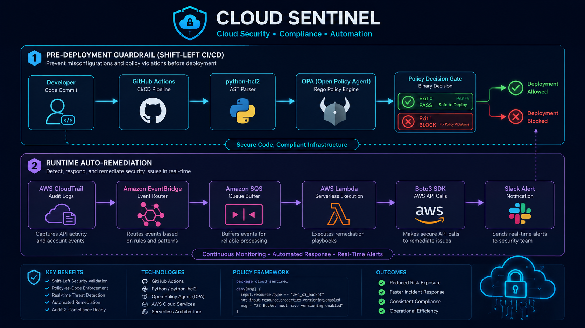
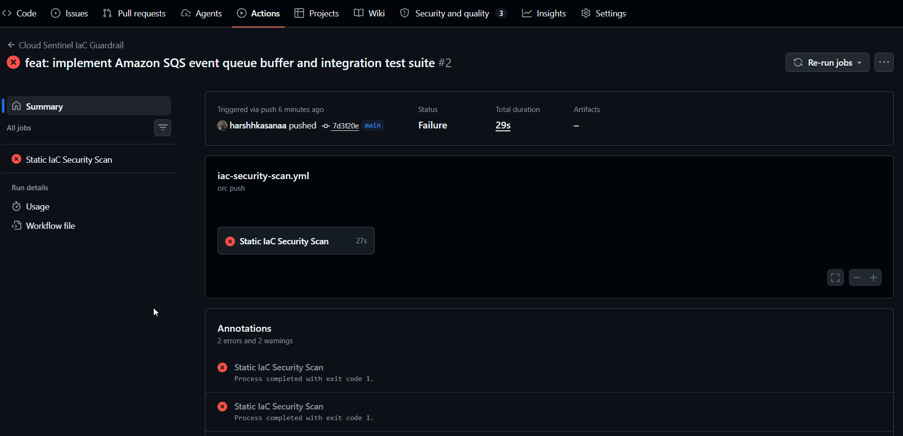
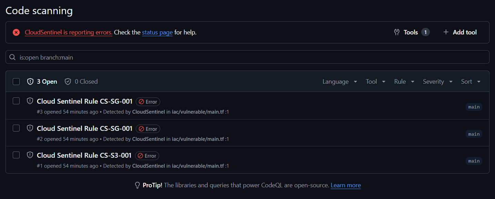

# 🛡️ Cloud Sentinel: Continuous IaC Guardrail & Event-Driven Auto-Remediation Engine

> An enterprise-grade, zero-trust cloud security platform combining **Pre-Deployment IaC Guardrails** (Shift-Left CI/CD with OPA Rego AST parsing) and **Runtime Event-Driven Auto-Remediation** (Serverless Boto3 & Amazon SQS Queue Buffering).

---

## 📐 Architecture Overview


---

## 🚀 Key Features & Enterprise Engineering Design

1. **Abstract Syntax Tree (AST) Lexical Analysis:** Parses Terraform HCL code into structured Python dictionaries using `python-hcl2`, eliminating fragile regular expression string matching.
2. **OPA Rego Policy Engine Integration:** Decouples policy logic from Python code execution, using declarative Open Policy Agent (`.rego`) rules.
3. **SARIF v2.1.0 Compliance & GitHub Security Integration:** Outputs static scan results to standardized SARIF JSON files, generating inline code vulnerability annotations inside GitHub Pull Request diff views.
4. **Buffered High-Throughput Event Processing:** Utilizes Amazon SQS as a queue buffer between EventBridge and Lambda workers, preventing API throttling during high-volume deployment waves.
5. **Sub-5-Second Runtime Auto-Remediation:** Listens for CloudTrail `AuthorizeSecurityGroupIngress` events and automatically executes `boto3` SDK calls to revoke `0.0.0.0/0` exposure on sensitive ports (SSH 22, RDP 3389).
6. **Hermetic Test Harness:** Evaluates both insecure and compliant IaC codebases locally, supported by a `pytest` suite with `unittest.mock` for zero-cost offline validation against LocalStack.

---

## 📂 Repository Layout

```text
cloud-sentinel/
├── .github/
│   └── workflows/
│       └── iac-security-scan.yml    # Automated GitHub Actions CI/CD pipeline
├── docs/
│   └── screenshots/                 # Repository visual documentation proof
├── docker/
│   └── docker-compose.yml           # LocalStack Docker emulation environment
├── iac/
│   ├── vulnerable/                  # Non-compliant Terraform code targets
│   └── secure/                      # Compliant, hardened Terraform reference
├── scanner/
│   ├── rules/
│   │   └── cloud_sentinel.rego      # Declarative OPA Rego security policies
│   ├── main.py                      # Core AST scanner CLI engine
│   └── report.py                    # SARIF v2.1.0 JSON generator module
├── remediation/
│   ├── handlers/
│   │   └── sg_remediator.py         # Serverless Boto3 remediation handler
│   ├── sqs_processor.py             # SQS queue event processor
│   └── notifier.py                  # Webhook alert card dispatcher
├── tests/
│   ├── mock_event.json              # Direct CloudTrail test payload
│   ├── mock_sqs_event.json          # SQS wrapped CloudTrail payload
│   ├── test_remediator.py           # Lambda handler integration test
│   └── test_sqs_processor.py        # SQS queue processor integration test
├── Makefile                         # Single-command execution orchestration
├── requirements.txt                 # Project dependencies
└── README.md                        # Platform documentation
```

---

## 🧪 Comprehensive Test Cases & Execution Proof

### Test Case 1: Pre-Deployment Guardrail — Insecure Infrastructure Target

* **Target Directory:** `iac/vulnerable/main.tf`
* **Objective:** Verify that the AST scanner detects unencrypted S3 buckets (`CS-S3-001`), public SSH port 22 exposure (`CS-SG-001`), and public RDP port 3389 exposure (`CS-SG-001`), returning `Exit Code 1` to halt pipeline execution.
* **Command:** `python scanner/main.py --dir iac/vulnerable`
* **Result:** `❌ FAIL: Found 3 security violation(s) via OPA Engine. Exit Code: 1`

#### 📸 Screenshot 1: Insecure Target Terminal Output


---

### Test Case 2: Pre-Deployment Guardrail — Compliant Infrastructure Target

* **Target Directory:** `iac/secure/main.tf`
* **Objective:** Verify that compliant Terraform configurations containing inline server-side encryption and restricted CIDR blocks pass security validation cleanly without false positives.
* **Command:** `python scanner/main.py --dir iac/secure`
* **Result:** `✅ PASS: No security violations found in IaC templates. Exit Code: 0`

#### 📸 Screenshot 2: Compliant Target Terminal Output


---

### Test Case 3: Runtime Auto-Remediation & SQS Queue Integration Test Suite

* **Target Files:** `tests/test_remediator.py`, `tests/test_sqs_processor.py`
* **Objective:** Validate that the SQS queue processor unmarshals batched event envelopes, routes payloads to `sg_remediator.py`, and triggers `boto3` SDK revocation calls on sensitive port exposures (`0.0.0.0/0`).
* **Command:** `pytest tests/test_sqs_processor.py -v -s`
* **Result:** `✅ PASSED (1 passed in 0.26s)`

#### 📸 Screenshot 3: Pytest Integration Suite Execution

*(Save screenshot of terminal executing pytest for `test_sqs_processor.py` with green PASSED status)*


---

### Test Case 4: Automated GitHub Actions CI/CD Security Gate

* **Trigger:** Code push / Pull Request against `main` branch.
* **Objective:** Ensure GitHub Actions runner executes static analysis, logs findings to `report.sarif`, uploads results to GitHub Code Scanning, and blocks pull request merge on security violations.

#### 📸 Screenshot 4: GitHub Actions Workflow Execution



#### 📸 Screenshot 5: GitHub Code Scanning Security Dashboard (SARIF Annotations)



---

## ⚡ Quick Start & Local Development

### 1. Prerequisites

* **Python:** `3.10+`
* **Docker Desktop:** Running locally

### 2. Environment Setup

```bash
# Clone repository
git clone https://github.com/YOUR_USERNAME/cloud-sentinel.git
cd cloud-sentinel

# Create and activate virtual environment
python3 -m venv venv
source venv/bin/activate  # On Windows: .\venv\Scripts\Activate.ps1

# Install dependencies
pip install -r requirements.txt
```

### 3. Run Static IaC Scans

```bash
# Scan vulnerable target (Expect Exit Code 1)
python scanner/main.py --dir iac/vulnerable --sarif report.sarif

# Scan secure target (Expect Exit Code 0)
python scanner/main.py --dir iac/secure
```

### 4. Run Pytest Integration Suite

```bash
pytest tests/ -v -s
```

---

## 🛡️ Guardrail Rules & Threat Matrix

| Rule ID | Severity | Target Resource | Vector / Mitigated Risk |
| --- | --- | --- | --- |
| **CS-SG-001** | `CRITICAL` | `aws_security_group` | Ingress open to `0.0.0.0/0` on sensitive management ports (SSH 22, RDP 3389). Mitigates brute-force key cracking. |
| **CS-S3-001** | `HIGH` | `aws_s3_bucket` | Missing server-side encryption or public access block configurations. Mitigates public data exposure. |
| **CS-RT-001** | `CRITICAL` | `aws_security_group` | Runtime console drift opening SSH access. Automatically revokes rule via Boto3 in under 5 seconds. |

---

## 📜 License

Distributed under the MIT License. See `LICENSE` for more information.