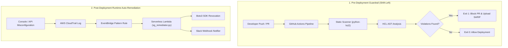

# 🛡️ Cloud Sentinel: Continuous Cloud Guardrail & Auto-Remediation Engine

> An enterprise-grade, zero-trust cloud security platform combining **Pre-Deployment IaC Guardrails** (Shift-Left CI/CD) and **Runtime Event-Driven Auto-Remediation** (Serverless Boto3).

---

## 📐 Architecture Overview



---

## 🚀 Key Features

* **Abstract Syntax Tree (AST) Parsing:** Parses Terraform `.tf` files into structured HCL2 AST dictionaries using `python-hcl2`, avoiding fragile regular expression matches.
* **SARIF Integration:** Export findings to `report.sarif` (SARIF v2.1.0) for native inline code annotations in GitHub Code Scanning.
* **CI/CD Security Gate:** Integrates into GitHub Actions (`.github/workflows/iac-security-scan.yml`) to enforce `sys.exit(1)` build blocks on critical findings.
* **Event-Driven Auto-Remediation:** Listens for CloudTrail `AuthorizeSecurityGroupIngress` audit events and automatically revokes `0.0.0.0/0` exposure on sensitive ports (SSH/22, RDP/3389) in under 5 seconds.
* **Zero-Cost Local Emulation:** Developed and tested against **LocalStack** inside Docker for local integration testing without cloud API charges.

## 📂 Repository Structure

```text
cloud-sentinel/
├── .github/
│   └── workflows/
│       └── iac-security-scan.yml    # GitHub Actions workflow
├── docker/
│   └── docker-compose.yml           # LocalStack Docker setup
├── iac/
│   ├── vulnerable/                  # Insecure Terraform test templates
│   └── secure/                      # Compliant Terraform templates
├── scanner/
│   ├── main.py                      # Core AST scanner CLI engine
│   └── report.py                    # SARIF v2.1.0 report generator
├── remediation/
│   ├── handlers/
│   │   └── sg_remediator.py         # Serverless Boto3 remediation handler
│   └── notifier.py                  # Webhook alert dispatcher
├── tests/
│   ├── mock_event.json              # Sample CloudTrail audit payload
│   └── test_remediator.py           # Integration test suite
├── Makefile                         # Single-command orchestration
├── requirements.txt                 # Python dependencies
└── README.md                        # Documentation
```

## ⚡ Quick Start & Local Execution

### 1. Prerequisites

* Python 3.10+
* Docker Desktop

### 2. Environment Setup

```bash
# Clone the repository
git clone https://github.com/your-username/cloud-sentinel.git
cd cloud-sentinel

# Initialize virtual environment
python3 -m venv venv
source venv/bin/activate  # On Windows: .\venv\Scripts\Activate.ps1

# Install dependencies
pip install -r requirements.txt
```

### 3. Run Static IaC Security Scan

```bash
# Run scan against vulnerable Terraform files
python scanner/main.py --dir iac/vulnerable --sarif report.sarif
```

### 4. Run Integration Tests

```bash
# Execute Pytest suite for runtime remediation engine
pytest tests/test_remediator.py -v -s
```

## 🔍 Threat Model & Guardrail Rules

| **Rule ID**   | **Severity** | **Vector**                                  | **Mitigated Attack Risk**                                                                              |
| ------------- | ------------ | ------------------------------------------- | ------------------------------------------------------------------------------------------------------ |
| **CS-SG-001** | `CRITICAL`   | `0.0.0.0/0` Ingress on Port 22 / 3389       | Prevents automated internet brute-force attacks and unauthorized SSH/RDP command shell access.         |
| **CS-S3-001** | `HIGH`       | S3 Missing Encryption / Public Access Block | Prevents public exposure of sensitive corporate data objects and enforces server-side encryption.      |
| **CS-RT-001** | `CRITICAL`   | Runtime Console Drift                       | Reverts manual console modifications that expose internal networks within 5 seconds of event creation. |

---
